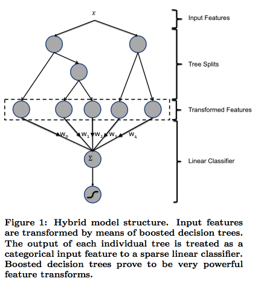
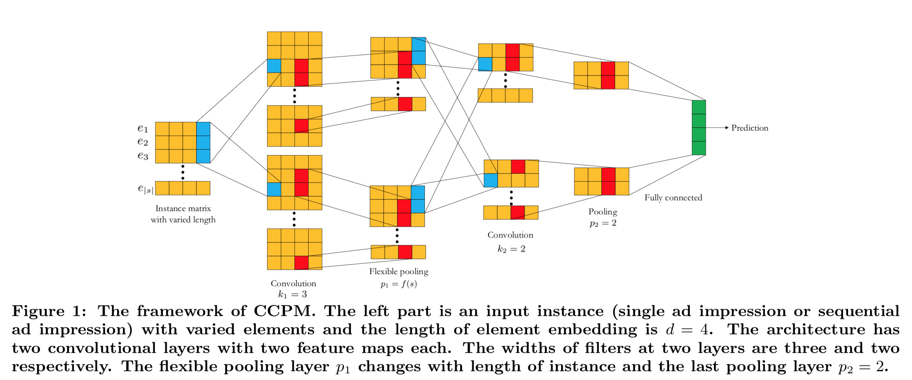
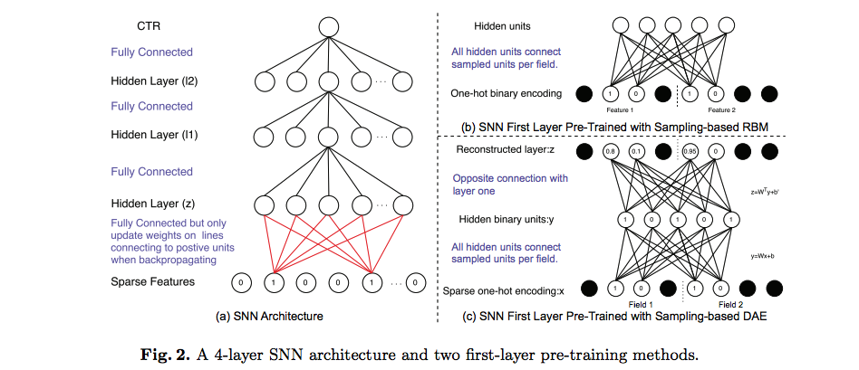

Recommender System Paper

|  Year | Category  | Title  |  
|---|---|---|
| ADKDD2014	  | System  | [Practical lessons from predicting clicks on ads at facebook](#adkdd2014)  |
| CIKM2015  | CNN  | [A Convolutional Click Prediction Model](#cikm2015)  |
| ECIR2016  | FM Neural Nets  | [Deep Learning over Multi-field Categorical Data: A Case Study on User Response Prediction](#ecir2016)  |

## [Practical lessons from predicting clicks on ads at facebook](http://citeseerx.ist.psu.edu/viewdoc/download?doi=10.1.1.718.9050&rep=rep1&type=pdf)

* Leverage boosting tree for feature transform and feed to linear model.
* Use online data joiner to keep training data fresh.
* The importance of features are quantified as the total squared error reduction in the boosting tree.

## [A Convolutional Click Prediction Model](http://ir.ia.ac.cn/bitstream/173211/12337/1/A%20Convolutional%20Click%20Prediction%20Model.pdf)
Proposed the convolution click prediction model by leveraging the sequential behavioral information of the users. Each of the ad impression in the sequence is represented as an embedding $e_i$. Several convolution operations are applied to the input matrix $s$, then flexible pooling followed by another conv, pooling and finally a full connected layer.

## [Deep Learning over Multi-field Categorical Data: A Case Study on User Response Prediction](https://arxiv.org/pdf/1601.02376.pdf)

Proposed two model architectures, Factorization-machine supported Neural Network (FNN) and Sampling-based Neural Networks (SNN) to model the relationship of multi-fied categorical features beyond linearality. These two models are similar for most of the parts except the first 2 layers (input and first hidden). The categorical features are represented as one-hot encodings. 

For FNN, the first hidden layer neurons are only connected locally with the corresponding inputs in one field. This is to learn a low dimension representative of each category in a way similar to embeddings.

For SNN, the input layer and the first hidden layer are fully connected. Due to the hugh parameters between the first and second layers. The paper proposed two pre-training methods to learn the weights: sampling-based Restricted Boltzmann Machine (RBM) and sampling-based Denoising Auto-Encoder.

In summary, the major contribution of this paper is the proposed representative learning for the multi-field categorical features, including FM-like NN and RBM-NN and DAE-NN. All the three methods are aiming to effectively learn a low dimensional representative of the hugh input feature space.

